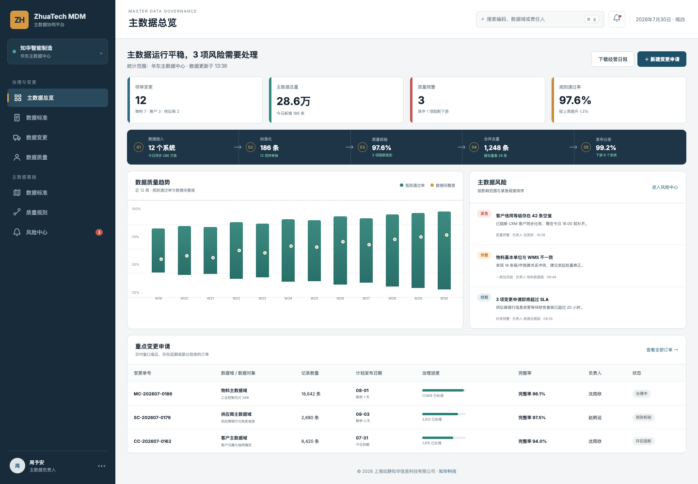
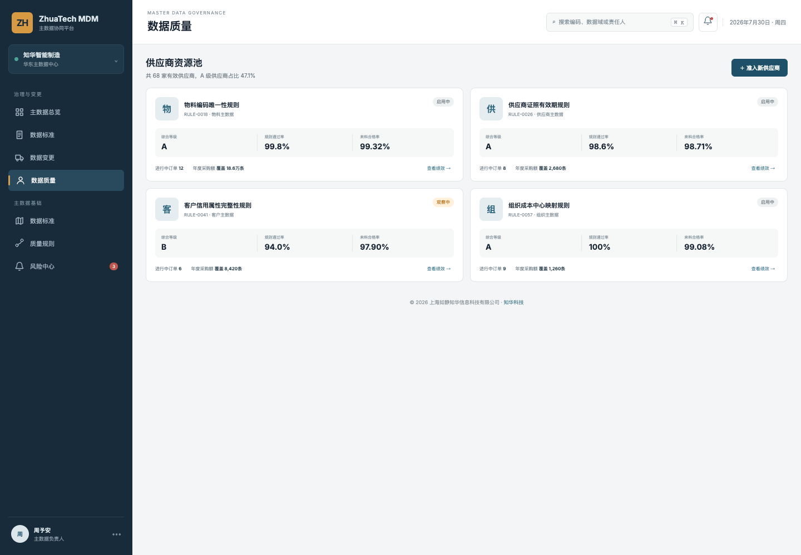
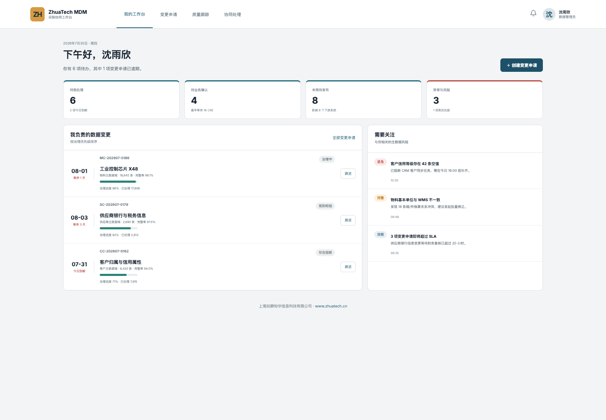
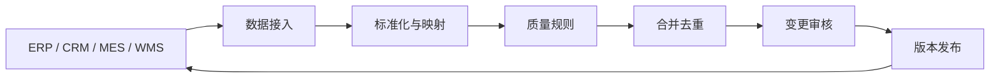

# ZhuaTech MDM

## 让主数据先统一，再流向业务系统

物料编码重复、客户口径不一、供应商证照过期、组织映射失准，最终都会变成业务流程中的返工。ZhuaTech MDM 是 **知华科技（上海如静知华信息科技有限公司）** 推出的主数据管理社区源码版，用一个可运行项目展示数据接入、标准化、质量校验、合并去重、变更审核和发布分发。

官网：[知华科技 https://www.zhuatech.cn/](https://www.zhuatech.cn/)

   

## 三个真实工作面

| 管理驾驶舱 | 数据质量中心 | 数据管理员工作台 |
| --- | --- | --- |
|  |  |  |
| 数据总量、待审变更、规则通过率与阻断风险 | 数据规则、覆盖范围、完整率和问题闭环 | 待办变更、业务确认、质量风险与发布进度 |

## 交付范围

- 数据域：物料、供应商、客户、组织等主数据模型示例
- 数据标准：编码、名称、分类、计量单位和引用关系
- 质量规则：唯一性、完整性、一致性、及时性和有效性
- 变更工作流：申请、数据审核、业务审核、发布和分发
- 数据治理驾驶舱：数据量、规则通过率、风险和治理进度
- 双端体验：桌面管理端与数据管理员协同端
- 基础能力：认证授权、REST API、MySQL、Flyway、Docker、CI

## 数据如何流转



## 目录与约定

| 项目 | 约定 |
| --- | --- |
| Java 包名 | `cn.zhuatech.mdm` |
| 后端 | Spring Boot / Security / JPA / Flyway |
| 前端 | Vue 3 / Router / Pinia / Vite |
| 数据库 | MySQL 8，库名 `zhuatech_mdm` |
| API | `/api/mdm` |

## 本地运行

只看产品演示：

```bash
cd frontend
npm install
npm run dev:demo
```

完整联调：

```bash
cp .env.example .env
# 先替换 MYSQL_ROOT_PASSWORD、MYSQL_PASSWORD、JWT_SECRET
docker compose up --build
```

演示账号：管理端 `admin / admin123`，数据管理员端 `buyer / admin123`。所有名称与数据均为虚构演示内容。

## 商业边界

源代码仅供个人非商业学习、研究和技术交流，不得商用。企业内部使用、SaaS、生产部署、客户交付、收费培训、投标及咨询实施均须取得上海如静知华信息科技有限公司书面授权，详见 [LICENSE](LICENSE)。

## 联系知华科技

需要主数据治理咨询、数据标准设计、MDM 系统深度开发、ERP/CRM/MES 集成或商业授权，请访问 [www.zhuatech.cn](https://www.zhuatech.cn/) 或扫码咨询。

| 微信一 | 微信二 |
| :---: | :---: |
|  |  |

搜索关键词：MDM 开源、主数据管理系统源码、数据治理平台、数据质量管理、物料主数据、供应商主数据、Java MDM、知华科技、上海如静知华信息科技有限公司。

## 主数据重复记录判定

`POST /api/mdm/duplicate-match` 将编码、名称、地址相似度、统一社会信用代码和冲突字段转换为匹配分，返回 `MERGE / REVIEW / KEEP_SEPARATE` 决策及证据列表。合并建议仍保留冲突字段提示，便于建立可审计的主数据治理流程。

## 黄金记录生存规则

新增 `POST /api/mdm/insights/golden-record-survivorship`，按字段完整度、来源核验、数据新鲜度、管理员确认和关键冲突对候选主数据排序，输出 `AUTO_MERGE / STEWARD_REVIEW / BLOCK_MERGE`。结果保留来源排名和字段级治理动作，支持可解释的黄金记录生成。
